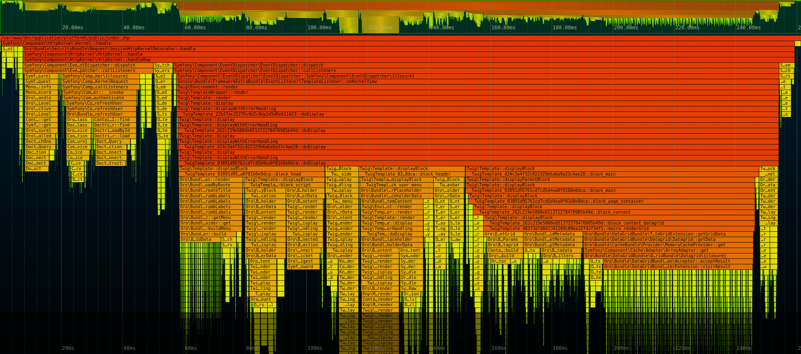

# OroPlatform Flex

Performance Optimized oro/platform fork to build your own admin. 

Main changes: 
 - Removed CRM and Commerce bundles.
 - Performance optimization
 - Return REST API and deprecation JSON:API
 - New Docker friendly crons 

| Request     | exc. time before  | exc. time after |
|-------------|-------------------|-----------------|
| Datagrid    | 270ms             | 121ms           |
| API request | 43ms              | 23ms            |

Before 
;

After 
;
